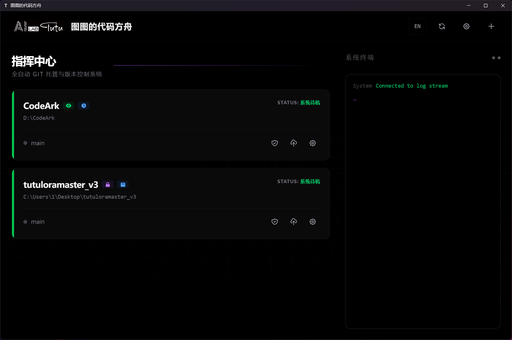
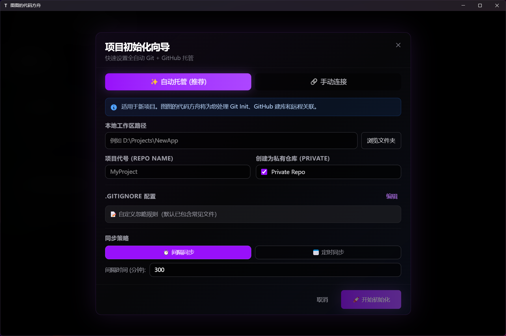
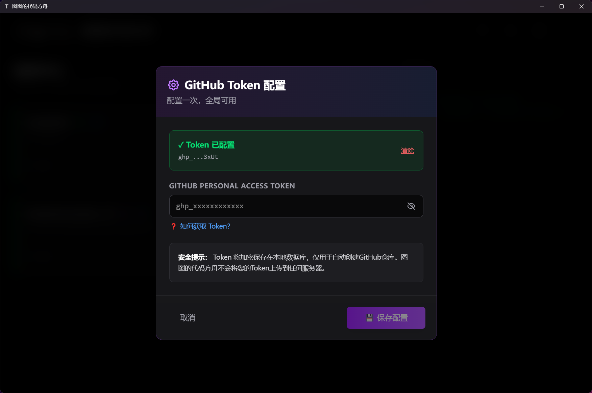
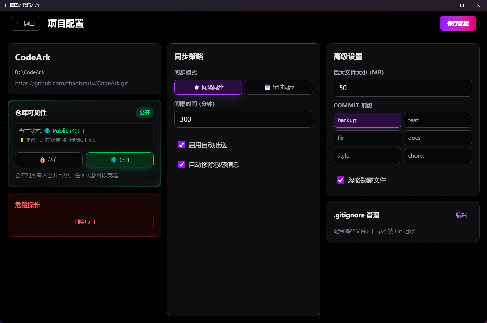

# 图图的代码方舟 TuTu's Code Ark

**简体中文** | [English](README_EN.md)

<div align="center">


**全自动 Git + GitHub 托管系统 | 版本控制 + 云端备份一体化解决方案**

[](https://opensource.org/licenses/MIT)
[](https://www.python.org/)
[](https://tauri.app/)
[](https://vuejs.org/)

</div>

---

## 💡 项目背景

随着 ChatGPT、Claude、Gemini、Copilot 等 AI 工具的普及，**编程门槛正在快速降低**。越来越多的新人通过 AI 辅助快速上手编程，几天内就能写出功能完整的项目。

**但问题来了**：

- 📝 **只会写代码，不会备份**：新手专注于实现功能，对代码备份没有概念，一次意外就可能前功尽弃
- 😰 **Git 学习曲线陡峭**：`add`、`commit`、`push`、`pull`、`merge`... 光是概念就能劝退一大批人
- ⏰ **容易忘记推送**：即使学会了 Git，也经常因为赶进度而忘记 `git push`，直到电脑崩溃才追悔莫及
- 🎯 **分散注意力**：每隔一段时间就要手动提交推送，打断思路，影响创作流

### 图图的代码方舟的使命

> **"你只管专注写代码，备份的事交给我"**

图图的代码方舟为 AI 编程时代而生 —— 让代码备份像呼吸一样自然，让开发者专注于创造本身。

---

## 🎯 主要功能

**图图的代码方舟 = 代码的自动保险箱**

一款专为开发者打造的**零操作自动备份工具**，让你再也不用担心代码丢失。

### 为什么选择图图的代码方舟？

- 💾 **真·全自动备份**：写完代码就忘了它，工具会自动帮你推送到 GitHub
- ⚡ **3分钟极速配置**：填个 Token就搞定
- 🔔 **托盘静默运行**：最小化到系统托盘，眼不见心不烦
- 🪶 **超轻量级**：内存占用 < 100MB，CPU 占用几乎为 0
- 🎨 **精致太空风 UI**：inspira-ui加持，赏心悦目的前端页面

### 适合谁用？

✅ 经常忘记 `git push` 的懒癌患者  
✅ 担心忽然停电硬盘突然坏掉的焦虑症患者  
✅ 需要多设备同步代码的游牧工作者  
✅ 想要版本回退保险的谨慎派  
✅ 毕业设计/重要项目的安全保障需求者

---

## 📸 产品预览

<div align="center">

### 🎨 主界面 - 太空风格UI



*简洁的项目管理界面，一目了然的状态监控*

---

### 🚀 一键初始化项目



*3分钟完成从本地到GitHub的全自动托管*

---

### 📊 实时日志推送



*WebSocket实时推送，每个操作都有迹可循*

---

### ⚙️ 简单明了的设置



*填个Token就能用，零学习成本*

</div>

---

## ✨ 核心特性

- 🚀 **一键初始化**：自动创建本地 Git 仓库 + GitHub 远程仓库
- 🔄 **智能同步**：支持间隔同步、定时同步多种策略，实现代码自动备份
- 🔒 **安全扫描**：自动检测大文件、二进制文件等风险内容
- 🌍 **多语言支持**：中文/English 界面切换
- 🎨 **现代化 UI**：暗黑主题，太空风格设计
- 📊 **实时日志**：WebSocket 实时推送操作日志
- 🛡️ **本地优先**：所有配置和 Token 均存储在本地数据库

---

## 📦 技术栈

### 前端

- **框架**：Vue 3 + TypeScript
- **桌面端**：Tauri 2.0
- **状态管理**：Pinia
- **UI 框架**：TailwindCSS
- **构建工具**：Vite

### 后端

- **框架**：FastAPI (Python 3.9+)
- **数据库**：SQLite
- **Git 操作**：GitPython
- **实时通信**：WebSocket
- **进程管理**：Watchdog

---

## 🚀 快速开始

### 环境要求

- **Node.js**: 18.0+
- **Python**: 3.9+
- **Rust**: 1.70+ (Tauri 开发需要)
- **Git**: 2.30+

### 安装依赖

#### 1. 克隆项目

```bash
git clone https://github.com/zhaotututu/CodeArk.git
cd CodeArk
```

#### 2. 前端依赖

```bash
npm install
```

#### 3. 后端依赖

```bash
cd backend
python -m venv venv

# Windows
venv\Scripts\activate

# Linux/Mac
source venv/bin/activate

pip install -r requirements.txt
```

### 开发模式

#### 启动后端服务

```bash
cd backend
venv\Scripts\activate
python main.py
```

后端默认运行在 `http://127.0.0.1:8000`

#### 启动前端开发服务器

```bash
npm run dev
```

前端开发服务器运行在 `http://localhost:5173`

#### 启动 Tauri 开发模式

```bash
npm run tauri dev
```

---

## 📝 配置说明

### GitHub Token 配置

图图的代码方舟需要 GitHub Personal Access Token 来自动创建远程仓库。

**获取步骤**：

1. 访问 [GitHub Settings → Personal Access Tokens](https://github.com/settings/tokens)
2. 点击 "Generate new token (classic)"
3. 选择权限：
   - ✅ `repo` - 完整仓库控制权限
   - ✅ `workflow` - GitHub Actions权限
4. 复制生成的 Token（以 `ghp_` 开头）
5. 在图图的代码方舟设置中粘贴并保存

**安全说明**：Token 使用 AES 加密存储在本地 SQLite 数据库中，不会上传到任何服务器。

### 同步策略

- **间隔同步**：每隔 N 分钟自动检测变更并推送
- **定时同步**：每天固定时间执行同步（如凌晨 2:00）

---

## 🔧 核心功能详解

### 1. 一键式项目托管

#### 🚀 自动托管模式（零配置上手）

从空白文件夹到 GitHub 仓库，**一个向导全搞定**：

1. **本地 Git 初始化**：自动创建 `.git` 仓库和 `.gitignore` 配置
2. **GitHub 仓库创建**：使用你的 Token 自动在 GitHub 创建远程仓库（支持 Public/Private）
3. **远程关联推送**：自动关联 `origin` 并完成首次推送
4. **启动实时监控**：立即开启文件变化监控

**适用场景**：新项目、毕业设计、从零开始的代码实验

#### 🔗 手动连接模式（接管现有项目）

已有 Git 项目？直接导入监控：

- 自动识别现有 Git 配置（分支、远程仓库）
- 兼容 clone 下来的项目

**适用场景**：已有的 GitHub 项目、团队协作项目、克隆的开源项目

---

### 2. 智能文件扫描系统

#### 📋 推送前安全检查

每次自动同步前，智能扫描变更文件：

- **大文件警告**：检测超过 10MB 的文件（可自定义阈值）
- **扩展名黑名单**：阻止 `.exe`、`.zip`、`.db` 等二进制文件
- **隐藏文件过滤**：自动忽略系统临时文件（`.DS_Store`、`__pycache__`）

#### 🛡️ .gitignore 可视化编辑

内置 `.gitignore` 编辑器：

- **常用模板一键添加**：Python、Node.js、Go 等语言的常见忽略规则
- **实时预览**：编辑后立即生效
- **智能补全**：提供常见忽略模式建议

---

### 3. 灵活的同步策略

#### ⏱️ 间隔同步（推荐）

设置时间间隔（如每 5 分钟），自动检测变更并推送：

- **智能去重**：短时间内多次保存只推送一次
- **无变化跳过**：没有文件修改时自动跳过，不会产生空提交
- **自定义间隔**：最低 1 分钟，最高任意时长

**适用场景**：日常开发、实时备份需求

#### 🕐 定时同步

每天固定时间执行一次备份（如凌晨 2:00）：

- **避免打扰**：白天专注编码，夜间自动备份
- **节省资源**：不需要持续监控，适合大型项目
- **批量提交**：将一天的修改合并为一次提交

**适用场景**：大型项目、团队协作、定期归档需求

---

### 4. 实时文件监控引擎

#### 👁️ Watchdog 监控

基于 Python Watchdog 的高性能文件监控：

- **递归监控**：自动监控所有子目录
- **事件过滤**：智能忽略 `.git`、`node_modules`、日志文件
- **防抖机制**：避免频繁保存导致的重复推送
- **资源友好**：低 CPU 和内存占用

#### 📊 变更统计

实时显示项目状态：

- 新增文件数
- 修改文件数
- 待推送变更数

---

### 5. 实时日志系统

#### 💬 WebSocket 双向通信

前后端通过 WebSocket 实时同步日志：

- **零延迟**：操作日志实时推送到界面
- **多级别分类**：INFO（蓝色）/ SUCCESS（绿色）/ ERROR（红色）
- **项目隔离**：每个项目独立显示日志
- **历史记录**：支持查看近期操作历史

#### 🌐 中英双语支持

所有日志消息支持中文/English 切换：

```json
{
  "sync_complete": {
    "zh": "✅ 同步完成，代码已推送到 GitHub",
    "en": "✅ Sync complete, code pushed to GitHub"
  }
}
```

---

### 6. 仓库可见性管理

#### 🔐 Public/Private 切换

创建项目时选择可见性，后续可随时切换：

- **一键切换**：在设置中一键修改仓库可见性
- **自动同步**：前端设置同步到 GitHub，无需手动操作
- **状态验证**：支持从 GitHub 同步真实状态到本地

#### 🔄 可见性同步

防止前后端状态不一致：

- 定期从 GitHub API 获取真实可见性状态
- 自动纠正本地配置与远程不符的情况

---

## 🗺️ 研发计划

### 核心理念：让代码"永不丢失"

围绕**自动备份防丢失**这一核心痛点，拒绝成为又一个复杂的Git客户端。均以"零操作"和"防丢失"为设计目标。

---

### 🚧 即将推出的功能

#### 🤖 智能 AI Commit 消息生成

**痛点**：自动推送很方便,但commit消息都是 "Auto commit" 毫无意义，无法回溯历史。

**方案**：

- AI 分析每次变更的代码内容，自动生成有意义的 commit 消息
- 示例：`"新增用户登录功能，修复密码验证bug"` 而不是 `"Auto commit 2024-11-21"`
- 支持自定义 AI 模型（OpenAI/Claude/本地 Ollama）
- 可选"简洁模式"（一句话）或"详细模式"（多行说明）

**差异化**：不需要手动写，也不需要审核，AI 自动决策后直接推送。

---

#### 🔀 极简分支管理（备份分支策略）

**痛点**：在 main 分支上随意改代码，万一改崩了想回退很麻烦。

**方案**：

- **自动实验分支**：检测到大量删除或重构时，自动创建 `backup/YYYY-MM-DD-HHMM` 分支保留原始代码
- **里程碑快照**：用户手动标记重要版本（如"功能完成""提交前备份"），自动创建 `milestone/xxx` 分支
- **一键回退**：界面上直接选择任意历史快照，一键恢复到那个状态
- **无需懂 Git**：不暴露 merge/rebase/cherry-pick 等复杂操作，只有"备份"和"恢复"

**差异化**：分支不是用来协作的，是用来防后悔的。

---

#### 🛡️ 多重备份保障机制

**痛点**：万一 GitHub 账号被封、仓库误删、或者网络问题导致推送失败？

**方案**：

- **本地时光机**：在本地额外保存每次推送前的完整快照（压缩存储，占用空间小）
- **多远程备份**：支持同时推送到 GitHub + GitLab + Gitee（国内备份）
- **离线缓存**：断网时推送失败会缓存操作，联网后自动重试
- **备份校验**：定期对比本地和远程差异，发现不一致自动告警

**差异化**：不只是推送到 GitHub，而是构建"三重保险"体系。

---

#### 🧠 代码重要性智能评估

**痛点**：修改了一个关键配置文件，但因为还在间隔时间内没有推送，结果电脑蓝屏了。

**方案**：

- AI 分析每次变更的文件类型和内容，评估重要性等级：
  - **高危变更**：数据库配置、核心业务逻辑、配置文件修改 → 立即推送（忽略间隔设置）
  - **普通变更**：UI调整、注释修改、日志添加 → 按正常间隔推送
  - **低风险变更**：README、文档、测试文件 → 可以延迟批量推送
- 可视化显示：哪些改动是"高危"（红色标记），让你心里有数

**差异化**：不是所有改动都一视同仁，重要的代码优先保护。

---

#### 🌍 多设备同步冲突智能解决

**痛点**：在公司和家里两台电脑上改代码，经常忘记拉取最新版本，导致冲突。

**方案**：

- **拉取优先模式**：每次推送前自动先检测是否有其他设备的更新
- **智能合并**：检测到冲突时，AI 自动分析代码逻辑，尝试自动合并
- **冲突避免提醒**：检测到"其他设备10分钟前推送过"，弹窗提醒你先拉取
- **设备标记**：每次 commit 自动带上设备名（如 `[Desktop] xxx` / `[Laptop] xxx`），方便识别

**差异化**：不需要你懂 merge，系统自动处理多设备协作。

---

#### 📦 灾难恢复一键还原

**痛点**：硬盘坏了/电脑被偷/误删项目文件夹，想从GitHub恢复很麻烦。

**方案**：

- **云端项目列表**：在新电脑上打开图图的代码方舟，自动显示你 GitHub 上所有备份的项目
- **一键克隆 + 配置恢复**：选择项目后自动克隆到本地，并恢复之前的监控配置
- **增量恢复**：如果本地还有残留文件，智能对比并只下载缺失的部分
- **配置云端备份**：项目的监控策略、ignore 规则等配置也同步到 GitHub（以 `.codeark.json` 形式）

**差异化**：换电脑就像换手机一样简单，一切自动恢复。

---

#### 📊 代码资产统计面板

**痛点**：不知道自己写了多少代码，哪些项目活跃，哪些已经废弃。

**方案**：

- **总代码行数统计**：自动分析所有备份项目的代码量（排除依赖包）
- **活跃度热力图**：日历视图显示每天的提交频率（类似 GitHub Contributions）
- **项目健康度评分**：多久没更新了？有没有大文件警告？是否需要清理？
- **备份完整性报告**：哪些项目有未推送的变更？哪些项目远程仓库已删除？

**差异化**：不只是备份工具，还是你的代码资产管理助手。

---

### 🚫 不会做的功能（避免功能膨胀）

为了保持"轻量级自动备份工具"的定位，以下功能**不在**计划内：

- ❌ Pull Request 审核和管理（用 GitHub 网页端）
- ❌ 复杂的分支工作流（GitFlow/GitHub Flow）
- ❌ 团队成员权限管理（用 GitHub 设置）
- ❌ Code Review 和 Diff 对比界面（用 VS Code 插件）
- ❌ Issue/Projects 看板集成（用 GitHub 原生功能）
- ❌ CI/CD Pipeline 配置（用 GitHub Actions）

**设计哲学**：只做"备份"这一件事，并把它做到极致。复杂的协作功能交给专业工具。

---

### 🎯 功能优先级

| 优先级 | 功能                     | 预计发布时间        |
| ------ | ------------------------ | ------------------- |
| 🔥 P0  | 智能 AI Commit 消息生成  | v0.2.0 (2026-Q1)    |
| 🔥 P0  | 多设备同步冲突智能解决   | v0.2.0 (2026-Q1)    |
| ⭐ P1  | 灾难恢复一键还原         | v0.3.0 (2026-Q2)    |
| ⭐ P1  | 代码重要性智能评估       | v0.3.0 (2026-Q2)    |
| 📌 P2  | 极简分支管理（备份分支） | v0.4.0 (看心情🤷)   |
| 📌 P2  | 多重备份保障机制         | v0.4.0 (看心情🤷)   |
| 💡 P3  | 代码资产统计面板         | v0.5.0 (画饼阶段🥧) |

> **开发进度说明**：P0/P1 是核心功能会尽力实现，P2/P3 属于"想到了但不一定做"系列，取决于作者的心情、时间和咖啡供应情况 ☕

---

## 🤝 贡献指南

欢迎提交 Issue 和 Pull Request！

---

## 📄 开源协议

本项目采用 [MIT License](LICENSE) 开源协议。

---

## 💬 联系方式

如有问题或建议，请通过以下方式联系：

- 提交 [GitHub Issue](https://github.com/zhaotututu/CodeArk/issues)
- QQ 331506796
- 图图感激您的支持：https://ko-fi.com/zhaotutu

**⭐ 如果觉得有用，请给项目点个星标！**

Made with ❤️ by TuTu
