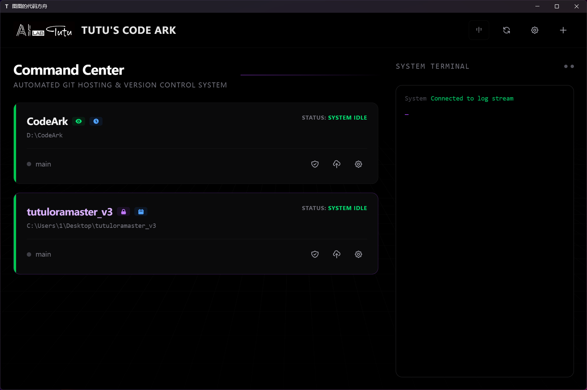
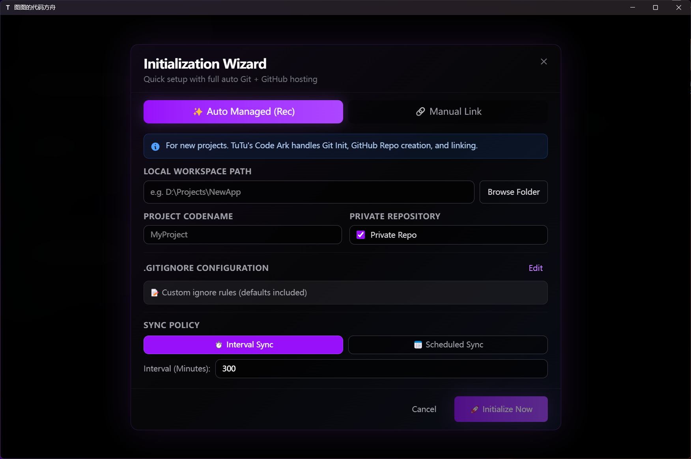
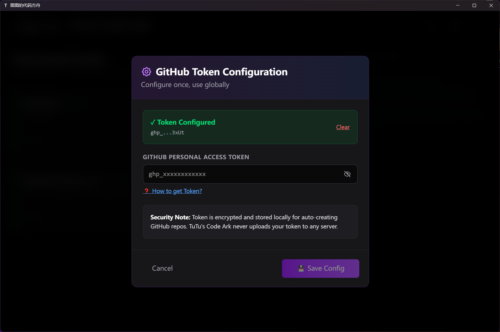
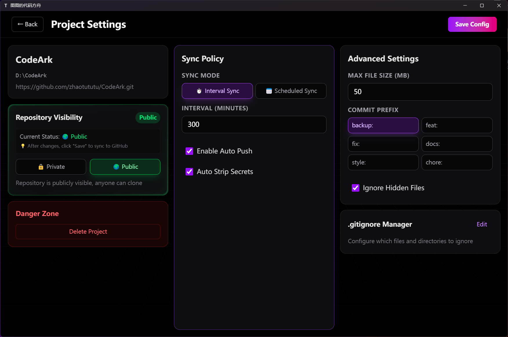

# TuTu's Code Ark

[简体中文](README.md) | **English**

<div align="center">


**Fully Automated Git + GitHub Management System | Version Control + Cloud Backup All-in-One Solution**

[](https://opensource.org/licenses/MIT)
[](https://www.python.org/)
[](https://tauri.app/)
[](https://vuejs.org/)

</div>

---

## 💡 Background

With the rise of ChatGPT, Claude, Gemini, Copilot and other AI tools, **the barrier to programming is rapidly lowering**. More and more newcomers are getting started with coding through AI assistance, building fully functional projects in just days.

**But here's the problem**:

- 📝 **Can code, but can't backup**: Beginners focus on implementing features, with no concept of code backup - one accident and all progress is lost
- 😰 **Steep Git learning curve**: `add`, `commit`, `push`, `pull`, `merge`... Just the concepts alone can discourage many
- ⏰ **Easy to forget pushing**: Even after learning Git, people often forget to `git push` when rushing progress, only regretting after computer crashes
- 🎯 **Distracts attention**: Having to manually commit and push periodically interrupts your flow and affects creativity

### TuTu's Code Ark's Mission

> **"You focus on writing code, leave backup to me"**

TuTu's Code Ark was born for the AI coding era — making code backup as natural as breathing, letting developers focus on creation itself.

---

## 🎯 Main Features

**TuTu's Code Ark = Your Code's Automatic Vault**

A **zero-operation automatic backup tool** built for developers, so you never have to worry about losing code again.

### Why Choose TuTu's Code Ark?

- 💾 **True Autopilot Backup**: Write your code and forget it - the tool automatically pushes to GitHub
- ⚡ **3-Minute Setup**: Just fill in a Token and you're done
- 🔔 **Silent Tray Mode**: Minimizes to system tray, out of sight, out of mind
- 🪶 **Ultra Lightweight**: Memory usage < 100MB, CPU usage nearly 0
- 🎨 **Stunning Space UI**: Powered by inspira-ui, a delightful frontend experience

### Who Is It For?

✅ Lazy coders who always forget to `git push`
✅ Anxious souls worried about sudden power outages or hard drive failures
✅ Digital nomads needing multi-device code sync
✅ Cautious types who want version rollback insurance
✅ Thesis/critical project safety requirement seekers

---

## 📸 Product Preview

<div align="center">

### 🎨 Main Dashboard - Space-Themed UI



*Clean project management interface with at-a-glance status monitoring*

---

### 🚀 One-Click Project Initialization



*From local to GitHub fully automated hosting in 3 minutes*

---

### 📊 Real-Time Log Streaming



*WebSocket real-time push, every operation tracked*

---

### ⚙️ Simple and Clear Settings



*Just fill in a Token and you're ready, zero learning curve*

</div>

---

## ✨ Core Features

- 🚀 **One-Click Initialization**: Automatically creates local Git repo + GitHub remote repo
- 🔄 **Smart Sync**: Supports interval sync, scheduled sync strategies for automatic code backup
- 🔒 **Security Scanning**: Auto-detects large files, binary files, and other risky content
- 🌍 **Multi-Language Support**: Chinese/English UI switching
- 🎨 **Modern UI**: Dark theme with space-inspired design
- 📊 **Real-Time Logs**: WebSocket real-time operation log push
- 🛡️ **Local-First**: All configs and Tokens stored in local database

---

## 📦 Tech Stack

### Frontend

- **Framework**: Vue 3 + TypeScript
- **Desktop**: Tauri 2.0
- **State Management**: Pinia
- **UI Framework**: TailwindCSS
- **Build Tool**: Vite

### Backend

- **Framework**: FastAPI (Python 3.9+)
- **Database**: SQLite
- **Git Operations**: GitPython
- **Real-Time Communication**: WebSocket
- **Process Management**: Watchdog

---

## 🚀 Quick Start

### Requirements

- **Node.js**: 18.0+
- **Python**: 3.9+
- **Rust**: 1.70+ (Required for Tauri development)
- **Git**: 2.30+

### Installation

#### 1. Clone the Project

```bash
git clone https://github.com/yourusername/TuTu-Code-Ark.git
cd TuTu-Code-Ark
```

#### 2. Frontend Dependencies

```bash
npm install
```

#### 3. Backend Dependencies

```bash
cd backend
python -m venv venv

# Windows
venv\Scripts\activate

# Linux/Mac
source venv/bin/activate

pip install -r requirements.txt
```

### Development Mode

#### Start Backend Service

```bash
cd backend
venv\Scripts\activate
python main.py
```

Backend runs at `http://127.0.0.1:8000` by default

#### Start Frontend Dev Server

```bash
npm run dev
```

Frontend dev server runs at `http://localhost:5173`

#### Start Tauri Dev Mode

```bash
npm run tauri dev
```

---

## 📝 Configuration

### GitHub Token Setup

TuTu's Code Ark requires a GitHub Personal Access Token to automatically create remote repositories.

**Steps to Obtain**:

1. Visit [GitHub Settings → Personal Access Tokens](https://github.com/settings/tokens)
2. Click "Generate new token (classic)"
3. Select permissions:
   - ✅ `repo` - Full repository control
   - ✅ `workflow` - GitHub Actions access
4. Copy the generated Token (starts with `ghp_`)
5. Paste and save in TuTu's Code Ark settings

**Security Note**: Tokens are AES-encrypted and stored in local SQLite database, never uploaded to any server.

### Sync Strategies

- **Interval Sync**: Automatically detect changes and push every N minutes
- **Scheduled Sync**: Execute sync at fixed time daily (e.g., 2:00 AM)

---

## 🔧 Core Features Explained

### 1. One-Click Project Hosting

#### 🚀 Auto-Hosting Mode (Zero-Config)

From empty folder to GitHub repo, **one wizard does it all**:

1. **Local Git Init**: Auto-creates `.git` repo and `.gitignore` config
2. **GitHub Repo Creation**: Uses your Token to auto-create remote repo (Public/Private)
3. **Remote Link & Push**: Auto-links `origin` and completes first push
4. **Start Real-Time Monitoring**: Immediately begins file change monitoring

**Use Cases**: New projects, thesis work, code experiments from scratch

#### 🔗 Manual Connection Mode (Take Over Existing Projects)

Already have a Git project? Import directly for monitoring:

- Auto-recognizes existing Git config (branches, remote repos)
- Compatible with cloned projects

**Use Cases**: Existing GitHub projects, team collaboration projects, cloned open-source projects

---

### 2. Smart File Scanning System

#### 📋 Pre-Push Safety Check

Before each auto-sync, intelligently scan changed files:

- **Large File Warning**: Detects files over 10MB (customizable threshold)
- **Extension Blacklist**: Blocks `.exe`, `.zip`, `.db` and other binary files
- **Hidden File Filter**: Auto-ignores system temp files (`.DS_Store`, `__pycache__`)

#### 🛡️ Visual .gitignore Editor

Built-in `.gitignore` editor:

- **One-Click Common Templates**: Common ignore rules for Python, Node.js, Go, etc.
- **Live Preview**: Changes take effect immediately
- **Smart Completion**: Suggests common ignore patterns

---

### 3. Flexible Sync Strategies

#### ⏱️ Interval Sync (Recommended)

Set time interval (e.g., every 5 minutes) to auto-detect and push changes:

- **Smart Deduplication**: Multiple saves in short time only push once
- **Skip When Unchanged**: Auto-skips when no files modified, no empty commits
- **Custom Interval**: Minimum 1 minute, maximum any duration

**Use Cases**: Daily development, real-time backup needs

#### 🕐 Scheduled Sync

Execute backup once daily at fixed time (e.g., 2:00 AM):

- **Non-Intrusive**: Focus on coding during day, auto-backup at night
- **Resource-Saving**: No continuous monitoring, suitable for large projects
- **Batch Commits**: Merges a day's changes into one commit

**Use Cases**: Large projects, team collaboration, periodic archiving needs

---

### 4. Real-Time File Monitoring Engine

#### 👁️ Watchdog Monitoring

High-performance file monitoring based on Python Watchdog:

- **Recursive Monitoring**: Auto-monitors all subdirectories
- **Event Filtering**: Intelligently ignores `.git`, `node_modules`, log files
- **Debounce Mechanism**: Avoids repeated pushes from frequent saves
- **Resource-Friendly**: Low CPU and memory usage

#### 📊 Change Statistics

Real-time project status display:

- Number of new files
- Number of modified files
- Number of pending changes

---

### 5. Real-Time Logging System

#### 💬 WebSocket Bidirectional Communication

Frontend and backend sync logs via WebSocket in real-time:

- **Zero Latency**: Operation logs pushed to UI instantly
- **Multi-Level Classification**: INFO (blue) / SUCCESS (green) / ERROR (red)
- **Project Isolation**: Each project displays logs independently
- **History**: Supports viewing recent operation history

#### 🌐 Bilingual Support

All log messages support Chinese/English switching:

```json
{
  "sync_complete": {
    "zh": "✅ 同步完成，代码已推送到 GitHub",
    "en": "✅ Sync complete, code pushed to GitHub"
  }
}
```

---

### 6. Repository Visibility Management

#### 🔐 Public/Private Switching

Choose visibility when creating project, switch anytime later:

- **One-Click Switch**: Change repo visibility in settings with one click
- **Auto Sync**: Frontend settings sync to GitHub, no manual operation needed
- **State Verification**: Supports syncing real state from GitHub to local

#### 🔄 Visibility Sync

Prevents frontend-backend state inconsistency:

- Periodically fetch real visibility state from GitHub API
- Auto-corrects local config when it doesn't match remote

---

## 🗺️ Roadmap

### Core Philosophy: Make Code "Never Lost"

Focused on the **automatic backup to prevent loss** core pain point, refusing to become yet another complex Git client. All designed with "zero-operation" and "anti-loss" goals.

---

### 🚧 Upcoming Features

#### 🤖 Smart AI Commit Message Generation

**Pain Point**: Auto-push is convenient, but all commit messages are "Auto commit" - meaningless, can't trace history.

**Solution**:

- AI analyzes code changes to auto-generate meaningful commit messages
- Example: `"Add user login feature, fix password validation bug"` instead of `"Auto commit 2024-11-21"`
- Support custom AI models (OpenAI/Claude/local Ollama)
- Optional "concise mode" (one-liner) or "detailed mode" (multi-line description)

**Differentiation**: No manual writing or review needed, AI decides automatically and pushes directly.

---

#### 🔀 Minimalist Branch Management (Backup Branch Strategy)

**Pain Point**: Editing code freely on main branch, hard to rollback when things break.

**Solution**:

- **Auto Experiment Branches**: Detects major deletions or refactors, auto-creates `backup/YYYY-MM-DD-HHMM` branch to preserve original code
- **Milestone Snapshots**: Users manually mark important versions (e.g., "feature complete", "pre-submit backup"), auto-creates `milestone/xxx` branch
- **One-Click Rollback**: Choose any historical snapshot in UI, restore with one click
- **No Git Knowledge Required**: Doesn't expose merge/rebase/cherry-pick complexities, only "backup" and "restore"

**Differentiation**: Branches aren't for collaboration, they're for anti-regret.

---

#### 🛡️ Multiple Backup Safeguard Mechanism

**Pain Point**: What if GitHub account gets banned, repo accidentally deleted, or network issues cause push failures?

**Solution**:

- **Local Time Machine**: Locally saves complete snapshot before each push (compressed storage, minimal space)
- **Multi-Remote Backup**: Supports simultaneous push to GitHub + GitLab + Gitee (domestic backup)
- **Offline Cache**: Failed pushes during network outage are cached, auto-retry when online
- **Backup Verification**: Periodically compares local and remote differences, auto-alerts when inconsistent

**Differentiation**: Not just pushing to GitHub, but building a "triple insurance" system.

---

#### 🧠 Code Importance Smart Assessment

**Pain Point**: Modified a critical config file, but it hasn't been pushed yet due to interval timing, then computer blue-screens.

**Solution**:

- AI analyzes file type and content of each change, assesses importance level:
  - **High-Risk Changes**: Database config, core business logic, config file modifications → push immediately (ignore interval settings)
  - **Normal Changes**: UI adjustments, comment edits, log additions → push at normal intervals
  - **Low-Risk Changes**: README, docs, test files → can delay for batch push
- Visual display: Which changes are "high-risk" (red marker), so you know

**Differentiation**: Not all changes treated equally, important code gets priority protection.

---

#### 🌍 Multi-Device Sync Conflict Smart Resolution

**Pain Point**: Editing code on office and home computers, often forget to pull latest version, causing conflicts.

**Solution**:

- **Pull-First Mode**: Auto-checks for updates from other devices before each push
- **Smart Merge**: When conflict detected, AI auto-analyzes code logic, attempts auto-merge
- **Conflict Avoidance Reminder**: Detects "other device pushed 10 minutes ago", popup reminds you to pull first
- **Device Tagging**: Each commit auto-tagged with device name (e.g., `[Desktop] xxx` / `[Laptop] xxx`), easy to identify

**Differentiation**: No need to understand merge, system auto-handles multi-device collaboration.

---

#### 📦 Disaster Recovery One-Click Restore

**Pain Point**: Hard drive failed/computer stolen/accidentally deleted project folder, recovering from GitHub is troublesome.

**Solution**:

- **Cloud Project List**: Open TuTu's Code Ark on new computer, auto-displays all your GitHub backup projects
- **One-Click Clone + Config Restore**: Select project, auto-clones locally and restores previous monitoring config
- **Incremental Restore**: If local files remain, intelligently compares and only downloads missing parts
- **Config Cloud Backup**: Project monitoring strategies, ignore rules, etc. also sync to GitHub (as `.codeark.json`)

**Differentiation**: Switching computers is as simple as switching phones, everything auto-restores.

---

#### 📊 Code Asset Dashboard

**Pain Point**: Don't know how much code you've written, which projects are active, which are abandoned.

**Solution**:

- **Total Lines of Code Stats**: Auto-analyzes code volume of all backup projects (excludes dependencies)
- **Activity Heatmap**: Calendar view displays daily commit frequency (like GitHub Contributions)
- **Project Health Score**: How long since last update? Any large file warnings? Need cleanup?
- **Backup Integrity Report**: Which projects have unpushed changes? Which projects' remote repos are deleted?

**Differentiation**: Not just a backup tool, but your code asset management assistant.

---

### 🚫 Features We Won't Build (Avoid Feature Bloat)

To maintain the "lightweight auto-backup tool" positioning, the following features are **NOT** planned:

- ❌ Pull Request review and management (use GitHub web)
- ❌ Complex branch workflows (GitFlow/GitHub Flow)
- ❌ Team member permission management (use GitHub settings)
- ❌ Code Review and Diff comparison UI (use VS Code extensions)
- ❌ Issue/Projects board integration (use GitHub native features)
- ❌ CI/CD Pipeline configuration (use GitHub Actions)

**Design Philosophy**: Only do "backup" - this one thing - and do it to perfection. Leave complex collaboration features to specialized tools.

---

### 🎯 Feature Priority

| Priority | Feature                                     | Estimated Release     |
| -------- | ------------------------------------------- | --------------------- |
| 🔥 P0    | Smart AI Commit Message Generation          | v0.2.0 (2026-Q1)      |
| 🔥 P0    | Multi-Device Sync Conflict Smart Resolution | v0.2.0 (2026-Q1)      |
| ⭐ P1    | Disaster Recovery One-Click Restore         | v0.3.0 (2026-Q2)      |
| ⭐ P1    | Code Importance Smart Assessment            | v0.3.0 (2026-Q2)      |
| 📌 P2    | Minimalist Branch Management (Backup)       | v0.4.0 (Mood-based🤷) |
| 📌 P2    | Multiple Backup Safeguard Mechanism         | v0.4.0 (Mood-based🤷) |
| 💡 P3    | Code Asset Dashboard                        | v0.5.0 (Vaporware🥧)  |

> **Development Progress Note**: P0/P1 are core features we'll try our best to implement. P2/P3 are "thought of but might not do" series, depending on the author's mood, time, and coffee supply ☕

---

## 🤝 Contributing

Issues and Pull Requests are welcome!

---

## 📄 License

This project is licensed under the [MIT License](LICENSE).

---

## 💬 Contact

For questions or suggestions, please contact via:

- Submit a [GitHub Issue](https://github.com/yourusername/TuTu-Code-Ark/issues)
- QQ 331506796
- Tutu thanks you for your support: https://ko-fi.com/zhaotutu

**⭐ If you find it useful, please star the project!**

Made with ❤️ by TuTu
